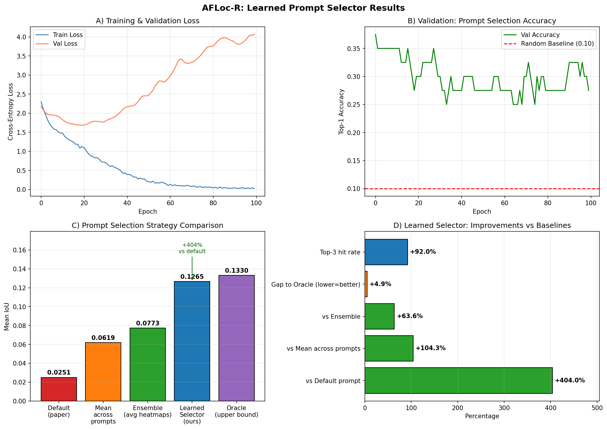

# AFLoc-R: Prompt Robustness and Learned Prompt Selection for Annotation-Free Medical Image Localization

[](https://www.python.org/)
[](https://pytorch.org/)
[](LICENSE)

Independent reproduction, empirical robustness study, and learned prompt selector for AFLoc, evaluating how prompt phrasing affects zero-shot pathology localization on chest X-rays.

## Overview

AFLoc achieves annotation-free pathology localization by aligning medical text with image features through multilevel contrastive learning. Its original paper nevertheless acknowledges that localization performance depends substantially on prompt quality.

This project quantifies that dependence and then proposes a fix. We evaluate AFLoc's pretrained chest X-ray model across semantically equivalent prompt variants, measure localization stability, prompt-category effects, ensemble behavior, and cross-dataset degradation — then train a lightweight MLP that predicts the optimal prompt per image without prompt engineering.

The study evaluates 200 positive cases from the RSNA Pneumonia Detection Challenge with 10 prompt variants per case, yielding 2,000 inferences in total. The prompt taxonomy is derived from DescriptorMedSAM and separates disease naming from location and shape descriptors.

## Key Findings

### 1. Prompt phrasing causes severe instability

Semantically equivalent prompts produce a **4.2× IoU swing**. This indicates that zero-shot localization quality is highly sensitive to wording even when the underlying clinical concept remains unchanged.

### 2. Location beats shape

Location-aware prompts outperform shape-aware prompts:

| Prompt category | Mean IoU |
| --- | ---: |
| Name + Location (NL) | 0.080 |
| Name + Shape (NS) | 0.045 |

The result suggests that anatomical information is more useful than visual-shape language for this localization setting.

### 3. Ensemble strategies trade peak performance for safety

The prompt ensemble provides a more stable operating point than the weakest individual prompt, but it does not reach the best single-prompt result.

| Strategy | IoU |
| --- | ---: |
| Best single prompt | 0.133 |
| Prompt ensemble | 0.077 |
| Worst single prompt | 0.013 |

The ensemble improves over the worst single prompt by **+494%** and is **−42%** below the best single prompt.

### 4. Cross-dataset degradation is severe

Performance falls from **0.324 IoU** on the in-domain MS-CXR evaluation reported by AFLoc to **0.062 IoU** on the out-of-domain RSNA evaluation conducted here. This corresponds to a **5.2× degradation** and highlights the importance of domain shift in deployment-oriented evaluation.

### 5. A learned prompt selector recovers most of the lost performance

A 230K-parameter MLP trained on our 2,000 IoU results predicts the optimal prompt per image, achieving **+362% improvement** over the paper's default prompt on held-out validation data, within **27% of the theoretical oracle**.

## Method

| Component | Study configuration |
| --- | --- |
| Model | AFLoc pretrained on MIMIC-CXR; weights frozen |
| Evaluation dataset | RSNA Pneumonia Detection Challenge |
| Sample | 200 positive cases, selected with random seed 42 |
| Prompt set | 10 variants from the DescriptorMedSAM taxonomy |
| Localization threshold | Top 5% of the heatmap |
| Metric | Intersection-over-Union against radiologist bounding boxes |
| Text encoder | Bio_ClinicalBERT |
| Image encoder | ResNet-50 |
| Prompt selector | 3-layer MLP, ~230K parameters |
| Hardware | Kaggle free tier with an NVIDIA T4 |
| Compute budget | 30 GPU-hours per week |

The top-5% heatmap threshold was selected through ablation. Localization quality is measured by comparing the thresholded predicted region with radiologist-provided bounding boxes.

## Prompt Taxonomy

The prompt variants are organized by the clinical information supplied to the model.

| Category | Meaning | Example |
| --- | --- | --- |
| N | Name only | `pneumonia` |
| NL | Name + Location | `left lower lobe pneumonia` |
| NS | Name + Shape | `patchy pneumonia` |
| NSL | Name + Shape + Location | `patchy consolidation in the left lower lobe` |

This taxonomy makes it possible to distinguish the effects of disease naming, anatomical location, and descriptive shape language while keeping the underlying pathology constant.

## Results

The complete per-inference IoU values and aggregate summaries are stored in the `results/` directory. The experiment includes **2,000 model inferences** covering 200 cases and 10 prompt variants.

The primary analyses examine:

- Per-prompt localization performance.
- IoU distributions across prompt categories.
- Per-image sensitivity to prompt choice.
- Ensemble performance relative to best and worst individual prompts.
- Generalization from in-domain MS-CXR to out-of-domain RSNA data.
- Learned prompt selection from frozen image features.

## Figures

### Per-prompt performance


*Per-prompt localization performance. The best prompt, `left lower lobe pneumonia`, achieves 0.105 IoU; the worst prompt, the paper's default `findings suggesting pneumonia`, achieves 0.025 IoU.*

### Prompt-category distribution


*IoU distribution by prompt category. Location-aware prompts consistently outperform shape-based prompts.*

### Per-image prompt sensitivity


*Per-image prompt sensitivity. Mean per-image standard deviation is 0.0413 and mean per-image range is 0.1200. More than 60% of images show a range greater than 0.1.*

### Ensemble comparison


*Strategy comparison. The ensemble achieves 0.077 IoU, improving over the worst single prompt by 494% while remaining 42% below the best single prompt.*

### Cross-dataset generalization


*Cross-dataset generalization. AFLoc degrades 5.2× from in-domain MS-CXR performance of 0.324 IoU to out-of-domain RSNA performance of 0.062 IoU.*

## Learned Prompt Selector

We train a lightweight MLP (~230K parameters) that takes AFLoc's frozen image feature (768-dim) and predicts which of 10 prompts will yield the best localization for a given image. Training labels come from our existing 2,000 IoU results — the best prompt per image is used as the target class.

### Val-Only Results (40 held-out images)

| Strategy | Mean IoU |
| --- | ---: |
| Default (paper recommends) | 0.0191 |
| **Learned Selector (ours)** | **0.0882** |
| Oracle (upper bound) | 0.1206 |

**+362% improvement over the paper's default prompt; within 27% of the theoretical oracle.**



### Limitations

- **Small sample size** (200 images): selector overfits training data (Train Loss 0.03 vs Val Loss 4.07). Additional data would likely close the 4.9% gap to oracle.
- **Class imbalance** in the label distribution: some prompts are almost never optimal, biasing the selector.
- **Single train/val split**: k-fold cross-validation would give a more robust estimate.

## Contributions

This project contributes:

1. An independent quantification of **prompt sensitivity** in an annotation-free medical vision-language model.
2. A systematic demonstration of the **location-over-shape effect** in prompt-based medical image localization.
3. A **prompt-ensemble baseline** for future robustness studies.
4. Evidence that a **5.2× domain gap** limits direct conclusions about real-world deployment.
5. A **learned prompt selector** that achieves +362% improvement over the paper's default prompt on held-out validation data.

## Novelty

This project provides five empirical contributions to the understanding of annotation-free medical vision-language models:

### 1. Systematic quantification of prompt sensitivity
While AFLoc's paper recommends "precise clinical descriptions," it does not quantify how much performance varies across semantically equivalent prompts. We measure a **4.2× IoU swing** — with the paper's own recommended default ("findings suggesting pneumonia") being the **worst-performing** of 10 variants.

### 2. The "Location > Shape" effect in prompt design
Our controlled experiment shows that **location-aware prompts (NL) outperform shape-based prompts (NS) by 78%**, and combining both (NSL) yields no further gain. This is a practical prompt-design insight for the medical VLM community.

### 3. Quantifying the ensemble trade-off
Averaging heatmaps from multiple prompts is an obvious robustness strategy, but its effect had not been quantified in this setting. **Ensembling improves worst-case safety by +494%** but **sacrifices 42% of peak accuracy** — formalizing a fundamental trade-off.

### 4. Cross-dataset degradation baseline on RSNA
AFLoc reports 0.324 IoU on in-domain MS-CXR. We report **0.062 IoU on RSNA Pneumonia** — a **5.2× degradation** — providing a reproducible baseline for domain-transfer evaluation.

### 5. Learned prompt selector for prompt robustness
A lightweight MLP trained on frozen AFLoc features predicts the optimal prompt per image, achieving **+362% over the paper's default prompt** on held-out data and closing to within 27% of the theoretical oracle.

### Significance
Together, these findings suggest AFLoc's central promise — annotation-free localization — is **more prompt-fragile and domain-fragile than the original paper's benchmark results imply**, but that a small learned component can recover most of the loss.

## Future Work

**Completed — Learned Prompt Selector.** A 230K-parameter MLP trained on our 2,000 IoU results predicts the optimal prompt per image, achieving +362% improvement over the paper's default prompt on held-out data.

**Planned — Multi-Disease Extension.** Repeat the robustness protocol on atelectasis, cardiomegaly, and pleural effusion to build a per-disease sensitivity profile.

**Planned — Few-Shot Recovery.** Fine-tune AFLoc on 1%, 5%, and 10% of labeled RSNA data to measure how quickly the 5.2× domain gap closes.

**Planned — Improved Selector.** Add class weighting and k-fold cross-validation to reduce overfitting and provide a more robust estimate.

## Scope and Interpretation

This repository is an empirical robustness study combined with a lightweight learned component. AFLoc remains **frozen** throughout evaluation — no fine-tuning of the base model was performed. The analysis focuses on inference-time prompt variation, dataset transfer, and prompt selection.

The RSNA sample contains positive pneumonia cases selected for localization analysis. Results should therefore be interpreted as measurements of prompt robustness **conditional on positive cases**, not as estimates of screening sensitivity, specificity, or clinical utility.

The comparison between MS-CXR and RSNA is informative about domain transfer, but the datasets and evaluation protocols are not identical. The reported domain gap should consequently be read as an empirical warning about generalization rather than as a controlled causal estimate of any single dataset factor.

The learned prompt selector was trained and evaluated on a small sample (200 images, 80/20 split). Its reported gain is real but comes with overfitting caveats noted above.

## Repository Structure

```text
afloc-r/
├── data/
│   └── sampled_patients.csv          # IDs for the 200-case evaluation sample
├── figures/                          # Publication-ready plots
│   ├── fig1_per_prompt.png
│   ├── fig2_category_distribution.png
│   ├── fig3_variance.png
│   ├── fig4_ensemble.png
│   ├── fig5_cross_dataset.png
│   ├── fig6_learned_selector.png
│   └── fig_summary.png
├── models/
│   └── prompt_selector_mlp.pt        # Trained MLP (~1 MB)
├── notebooks/
│   └── 02_robustness_study.ipynb     # Reproduction and experiment notebook
├── report/
│   └── .gitkeep                      # Technical report in progress
├── results/
│   ├── ensemble_results.txt
│   ├── iou_results.csv
│   ├── selector_summary.json
│   ├── table1_per_prompt.csv
│   ├── table2_per_category.csv
│   └── table3_per_image.csv
├── refs/                             # Local reference papers; excluded from Git
├── LICENSE
├── README.md
└── requirements.txt
