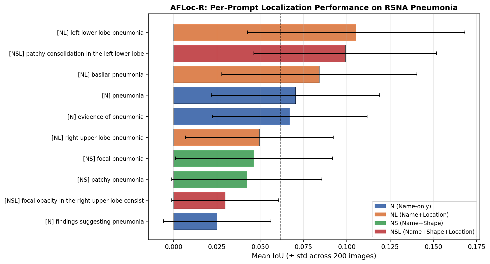
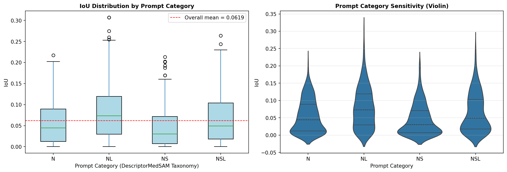
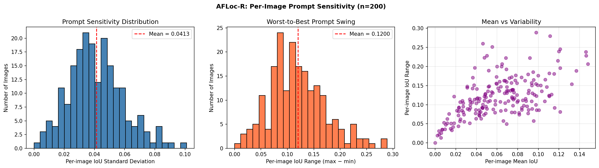
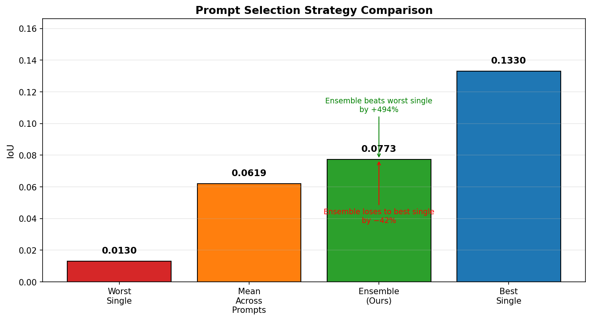
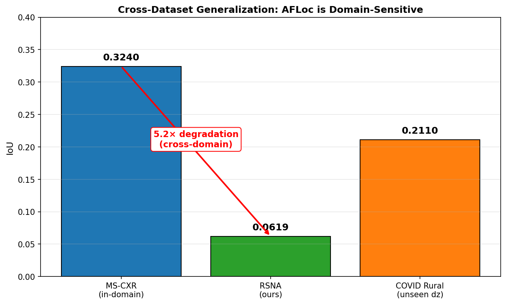

# AFLoc-R: Prompt Robustness in Annotation-Free Medical Image Localization

[](https://www.python.org/)
[](https://pytorch.org/)
[](LICENSE)

Independent reproduction and empirical study of AFLoc, evaluating how prompt phrasing affects zero-shot pathology localization on chest X-rays.

## Overview

AFLoc achieves annotation-free pathology localization by aligning medical text with image features through multilevel contrastive learning. Its original paper nevertheless acknowledges that localization performance depends substantially on prompt quality.

This project quantifies that dependence. We evaluate AFLoc's pretrained chest X-ray model across semantically equivalent prompt variants and measure localization stability, prompt-category effects, ensemble behavior, and cross-dataset degradation.

The study evaluates 200 positive cases from the RSNA Pneumonia Detection Challenge with 10 prompt variants per case, yielding 2,000 inferences in total. The prompt taxonomy is derived from DescriptorMedSAM and separates disease naming from location and shape descriptors.

## Key Findings

### 1. Prompt phrasing causes severe instability

Semantically equivalent prompts produce a 4.2x IoU swing. This indicates that zero-shot localization quality is highly sensitive to wording even when the underlying clinical concept remains unchanged.

### 2. Location beats shape

Location-aware prompts outperform shape-aware prompts:

| Prompt category | Mean IoU |
| --- | ---: |
| Name + Location (NL) | 0.080 |
| Name + Shape (NS) | 0.045 |

The result suggests that anatomical information is more useful than visual-shape language for this localization setting.

### 3. Ensemble strategies trade peak performance for safety

The prompt ensemble provides a more stable operating point than the weakest individual prompt, but it does not reach the best single-prompt result.

| Strategy | IoU |
| --- | ---: |
| Best single prompt | 0.133 |
| Prompt ensemble | 0.077 |
| Worst single prompt | 0.013 |

The ensemble improves over the worst single prompt by 494% and is 42% below the best single prompt.

### 4. Cross-dataset degradation is severe

Performance falls from 0.324 IoU on the in-domain MS-CXR evaluation reported by AFLoc to 0.062 IoU on the out-of-domain RSNA evaluation conducted here. This corresponds to a 5.2x degradation and highlights the importance of domain shift in deployment-oriented evaluation.

## Method

| Component | Study configuration |
| --- | --- |
| Model | AFLoc pretrained on MIMIC-CXR; weights frozen |
| Evaluation dataset | RSNA Pneumonia Detection Challenge |
| Sample | 200 positive cases, selected with random seed 42 |
| Prompt set | 10 variants from the DescriptorMedSAM taxonomy |
| Localization threshold | Top 5% of the heatmap |
| Metric | Intersection-over-Union against radiologist bounding boxes |
| Text encoder | Bio_ClinicalBERT |
| Image encoder | ResNet-50 |
| Hardware | Kaggle free tier with an NVIDIA T4 |
| Compute budget | 30 GPU-hours per week |

The top-5% heatmap threshold was selected through ablation. Localization quality is measured by comparing the thresholded predicted region with radiologist-provided bounding boxes.

## Prompt Taxonomy

The prompt variants are organized by the clinical information supplied to the model.

| Category | Meaning | Example |
| --- | --- | --- |
| N | Name only | `pneumonia` |
| NL | Name + Location | `left lower lobe pneumonia` |
| NS | Name + Shape | `patchy pneumonia` |
| NSL | Name + Shape + Location | `patchy consolidation in the left lower lobe` |

This taxonomy makes it possible to distinguish the effects of disease naming, anatomical location, and descriptive shape language while keeping the underlying pathology constant.

## Results

The complete per-inference IoU values and aggregate summaries are stored in the `results/` directory. The experiment includes 2,000 model inferences covering 200 cases and 10 prompt variants.

The primary analyses examine:

- Per-prompt localization performance.
- IoU distributions across prompt categories.
- Per-image sensitivity to prompt choice.
- Ensemble performance relative to best and worst individual prompts.
- Generalization from in-domain MS-CXR to out-of-domain RSNA data.

## Figures

### Per-prompt performance



*Per-prompt localization performance. The best prompt, `left lower lobe pneumonia`, achieves 0.105 IoU; the worst prompt, the paper's default `findings suggesting pneumonia`, achieves 0.025 IoU.*

### Prompt-category distribution



*IoU distribution by prompt category. Location-aware prompts consistently outperform shape-based prompts.*

### Per-image prompt sensitivity



*Per-image prompt sensitivity. Mean per-image standard deviation is 0.0413 and mean per-image range is 0.1200. More than 60% of images show a range greater than 0.1.*

### Ensemble comparison



*Strategy comparison. The ensemble achieves 0.077 IoU, improving over the worst single prompt by 494% while remaining 42% below the best single prompt.*

### Cross-dataset generalization



*Cross-dataset generalization. AFLoc degrades 5.2x from in-domain MS-CXR performance of 0.324 IoU to out-of-domain RSNA performance of 0.062 IoU.*

## Contributions

This project contributes:

1. An independent quantification of prompt sensitivity in an annotation-free medical vision-language model.
2. A systematic demonstration of the location-over-shape effect in prompt-based medical image localization.
3. A prompt-ensemble baseline for future robustness studies.
4. Evidence that a 5.2x domain gap limits direct conclusions about real-world deployment.

## Repository Structure

```text
AFLoc_R/
├── data/
│   └── sampled_patients.csv       # IDs for the 200-case evaluation sample
├── figures/                       # Publication-ready plots
│   ├── fig1_per_prompt.png
│   ├── fig2_category_distribution.png
│   ├── fig3_variance.png
│   ├── fig4_ensemble.png
│   ├── fig5_cross_dataset.png
│   └── fig_summary.png
├── notebooks/
│   └── 02_robustness_study.ipynb  # Reproduction and experiment notebook
├── report/
│   └── .gitkeep                    # Technical report in progress
├── results/                        # Raw IoU values and summary tables
│   ├── ensemble_results.txt
│   ├── iou_results.csv
│   ├── table1_per_prompt.csv
│   ├── table2_per_category.csv
│   └── table3_per_image.csv
├── refs/                           # Local reference papers; excluded from Git
├── LICENSE
└── README.md
```

## Scope and Interpretation

This repository is an empirical robustness study rather than a new model-training contribution. AFLoc remains frozen throughout evaluation, and the analysis focuses on inference-time prompt variation and dataset transfer.

The RSNA sample contains positive pneumonia cases selected for localization analysis. Results should therefore be interpreted as measurements of prompt robustness conditional on positive cases, not as estimates of screening sensitivity, specificity, or clinical utility.

The comparison between MS-CXR and RSNA is informative about domain transfer, but the datasets and evaluation protocols are not identical. The reported domain gap should consequently be read as an empirical warning about generalization rather than as a controlled causal estimate of any single dataset factor.

## Citation

Please cite the original AFLoc paper when using this work in research on annotation-free pathology localization:

> Yang, H., Zhou, H.-Y., Liu, J., et al. (2026). A multimodal vision-language model for generalizable annotation-free pathology localization. *Nature Biomedical Engineering*, 10(8), 1595–1609. https://doi.org/10.1038/s41551-025-01574-7

The prompt taxonomy is based on DescriptorMedSAM:

> Zhang, W., Luo, L., Hai, J., & Ye, J. (2026). DescriptorMedSAM: language-image fusion with multi-aspect text guidance for medical image segmentation. *Scientific Reports*. https://doi.org/10.1038/s41598-025-33843-5

## Author

**Ridoy Adhikary**

## Acknowledgments

This study builds on the AFLoc model and the public RSNA Pneumonia Detection Challenge. We thank the authors of AFLoc and DescriptorMedSAM for making the underlying research and methodological ideas available to the community.

## License

This project is released under the [MIT License](LICENSE).
